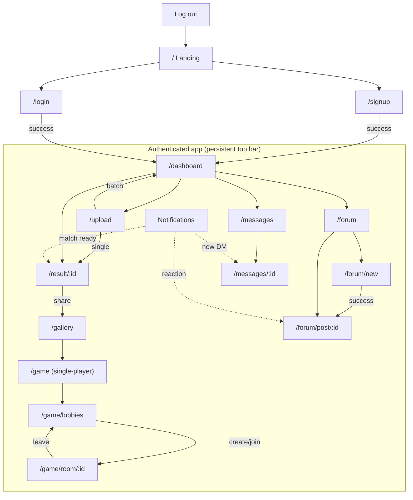

# Dogppelganger — Technical Specification

**Team:** Nadav Anolik, Ilona Grayfer, Michal Kfir
**Scope of this document:** every page in the web app — its purpose, UI components, the data and API it uses, real-time channels, states, and access rules — plus how the user navigates from any page to any other.

**Stack note:** this version targets the toolset used during the course — **Flask, Docker, MongoDB, Elasticsearch, and Kibana**.

---

## 1. Reference stack & conventions

These are assumed throughout the spec so each page can be described consistently.

- **Frontend:** Flask + Jinja2 server-rendered pages, progressively enhanced with JavaScript — `fetch` for dynamic actions (JSON endpoints) and a **Socket.IO client** for anything live (notifications, DMs, multiplayer, queue updates). A light CSS framework (e.g. Bootstrap) for layout is optional.
- **Backend:** **Flask** for page routes and JSON APIs, **Flask-SocketIO** for real-time, **Flask-Login** for sessions.
- **Primary database:** **MongoDB** — collections for `users`, `matches`, `jobs` (the queue), `posts`, `comments`, `conversations`/`messages`, `lobbies`/game state, `notifications`.
- **Media storage:** **GridFS** (MongoDB) for uploaded images and forum/DM attachments — a `GET /media/<file_id>` Flask route streams them. (A mounted Docker volume is an acceptable alternative for the demo.)
- **Search + vector store:** **Elasticsearch**, used for three things — (a) **dog-face matching** via `dense_vector` kNN over the AFHQ embeddings, (b) **full-text search** across forum posts/comments, (c) a **central log store** for the app and workers.
- **Monitoring / analytics:** **Kibana** dashboards over Elasticsearch — queue depth, per-client fairness, processing latency, error rates, forum activity. This is an ops surface for the team, not an end-user page.
- **Queue:** a MongoDB `jobs` collection acting as a priority queue; separate **worker containers** claim jobs atomically (`findOneAndUpdate`) ordered urgent-first then shortest-job-first (image byte size), with per-client fair scheduling. Progress is pushed to clients over Socket.IO.
- **ML service:** CLIP embedding of the (face-cropped) human upload, then an **Elasticsearch kNN query** against the pre-embedded AFHQ dog faces to retrieve the closest dog.
- **Real-time:** one authenticated **Socket.IO** connection per logged-in client, opened after login and reused everywhere. The server uses **Socket.IO rooms** — a per-user room for notifications/DMs and a per-lobby room for multiplayer.

**Auth model:** **Flask-Login session cookie** set at login. Page routes are guarded server-side (`@login_required`); JSON endpoints re-check the session; the Socket.IO connection is authenticated from the same session cookie on connect. No token is stored client-side.

**Route convention:** paths are shown SPA-style (e.g. `/result/:matchId`) for readability; in Flask these map to `@app.route("/result/<match_id>")`. `PUBLIC` = reachable logged-out · `AUTH` = requires login.

---

## 2. Page specifications

### 2.1 Landing / Home — `/`  · PUBLIC

**Purpose:** first impression; explains the concept and drives sign-up.

**Components:** hero with a sample human→dog match, short "how it works" strip, a few example matches pulled from the public gallery, primary CTA ("Try it — Sign up") and secondary ("Log in"). Top bar shows Log in / Sign up when logged out.

**Data / API:** `GET /api/gallery/featured?limit=6` for the sample matches (read-only, no auth); rendered into the template.

**States:** default; if the gallery is empty, fall back to bundled static sample images.

**Navigation out:** → Sign-up, → Login. If an already-authenticated user lands here, redirect to Dashboard.

---

### 2.2 Sign-up — `/signup`  · PUBLIC

**Purpose:** create an account.

**Components:** form (username, email, password, confirm password), inline validation, submit, link to Login.

**Data / API:** `POST /api/auth/signup` → creates a `users` document (hashed password), then establishes a Flask-Login session (auto-login). Username/email uniqueness checked server-side against MongoDB.

**States:** empty; validating; field errors (taken username, weak password, mismatch); submitting; success.

**Navigation out:** on success → Dashboard (logged in). Link → Login.

---

### 2.3 Login — `/login`  · PUBLIC

**Purpose:** authenticate an existing user.

**Components:** form (username/email + password), submit, error banner, link to Sign-up.

**Data / API:** `POST /api/auth/login` → verifies credentials, starts the Flask-Login session. On success the page opens the shared Socket.IO connection (which joins the user's personal room).

**States:** empty; submitting; invalid-credentials error; rate-limited (too many attempts).

**Navigation out:** on success → the originally requested page (`?next=`) or Dashboard. Link → Sign-up.

---

### 2.4 Upload / Match — `/upload`  · AUTH

**Purpose:** the core action — turn a human photo into a dog match. Handles both a single quick match and a batch upload.

**Components:**
- Drag-and-drop / file-picker accepting multiple `png`/`jpg`.
- Per-file row with a thumbnail, a remove button, and an **"Urgent"** toggle.
- "Match" submit button.
- After submit, an inline progress area (or immediate redirect — see below).

**Data / API:**
- `POST /api/match` (multipart, one or more images). The backend validates each file (type, size cap, safe decode), stores the original in GridFS, and inserts one document per image into the `jobs` collection with its `urgent` flag, owner, and byte size (used by the queue for shortest-job-first ordering). Returns the created `job_id`s; a single non-batch image may take a fast path and return the match directly.
- Progress arrives via **Socket.IO** as `queue_update` and `match_ready` events on the user's room (see Notifications, 2.11).

**States:** idle; files staged; validating; rejected file (wrong type / too large) shown inline without blocking the rest; uploading; enqueued.

**Navigation out:**
- **Single image** → the Result page once ready (spinner resolves into it).
- **Multiple images** → Dashboard, where each dog appears as its job completes, so the user isn't blocked on the batch. Notifications announce each completion regardless of the current page.

---

### 2.5 Result — `/result/:matchId`  · AUTH

**Purpose:** show a single completed human→dog match and let the user act on it.

**Components:** side-by-side of the uploaded human photo and the matched dog face; optional caption; action row — **Share to gallery**, **Download**, **Delete**, "Match another."

**Data / API:**
- `GET /api/match/:matchId` → the `matches` document (human + dog media IDs, metadata, shared flag).
- `POST /api/match/:matchId/share` / `DELETE .../share` → toggle public-gallery visibility.
- `DELETE /api/match/:matchId` → remove.

**Access guard:** a user may only view/act on their own match (owner checked in MongoDB); others get 403.

**States:** loading; loaded (shared vs not-shared); not-found/forbidden; deleting.

**Navigation out:** Share → item now appears in Gallery. "Match another" → Upload. Any global-nav link.

---

### 2.6 Public Gallery — `/gallery`  · AUTH

**Purpose:** browse all matches users chose to share; also the image pool the matching game draws from.

**Components:** responsive grid of shared human→dog pairs, owner handle, lazy-loaded / paginated, optional shuffle.

**Data / API:** `GET /api/gallery?page=n` → paginated shared `matches`. Images streamed from GridFS via `/media/<id>`.

**States:** loading (skeleton grid); loaded; empty ("no one has shared yet"); loading-more.

**Navigation out:** → matching game (uses this pool). Any global-nav link.

---

### 2.7 Personal Dashboard / "My Dogs" — `/dashboard`  · AUTH

**Purpose:** the logged-in user's private hub and the default post-login landing page.

**Components:**
- **My matches** grid — every completed dog, click-through to its Result page.
- **Processing queue** panel — images still being dogified, each with live status (queued / processing / done) and its urgent flag; rows update in real time and turn into finished matches on completion.
- **Shared items** — which of my matches are public.
- **My forum activity** — my posts and my total likes/dislikes received.

**Data / API:**
- `GET /api/me/matches` → completed matches.
- `GET /api/me/jobs` → in-flight queue jobs (initial state; then live via Socket.IO `queue_update` / `match_ready`).
- `GET /api/me/forum-stats` → post list + like/dislike totals (aggregation over MongoDB).

**States:** loading; loaded; empty (new user — prompt to upload); live-updating rows.

**Navigation out:** match → Result; "Upload more" → Upload; a post → Post detail. Any global-nav link.

---

### 2.8 Single-player Game — `/game`  · AUTH

**Purpose:** the matching game from the proposal — guess which person goes with which dog, drawn from shared results.

**Components:** a round shows a set of people and a set of dogs; the player links each person to a dog (drag lines or tap-pairing, matching the proposal's visual); submit; score/feedback; "next round."

**Data / API:**
- `GET /api/game/round` → a shuffled set of shared human/dog pairs with the correct mapping withheld (server keeps the answer keyed to a round token in MongoDB).
- `POST /api/game/round/:token/answer` → the player's pairing; returns correctness and score.

**States:** loading round; playing; submitted/reveal; next-round.

**Navigation out:** → Multiplayer lobbies ("Play with others"). Any global-nav link.

---

### 2.9 Multiplayer Lobby — `/game/lobbies`  · AUTH

**Purpose:** create or join a shared game room.

**Components:** list of open lobbies (name, host, player count), "Create lobby" button, "Join" per row.

**Data / API:**
- `GET /api/lobbies` → open lobbies (also live-updated over Socket.IO).
- `POST /api/lobbies` → create a `lobbies` document, returns `lobbyId`.
- `POST /api/lobbies/:id/join` → join.

**States:** loading; list; empty ("no open games — create one"); creating; joining; join-failed (full/closed).

**Navigation out:** create or join → Game room `/game/room/:lobbyId`.

---

### 2.10 Multiplayer Game Room — `/game/room/:lobbyId`  · AUTH

**Purpose:** the live shared game; players act on their own screens and everyone sees updates in real time, with server-authoritative state preventing contradictions.

**Components:** player list / ready states, the shared board (people ↔ dogs), each player's actions reflected live, round timer/score, leave button.

**Data / API + real-time:**
- Initial state: `GET /api/lobbies/:id/state`.
- On entry the client joins the **Socket.IO room** `lobby:<lobbyId>`. All in-game actions flow as Socket.IO events scoped to that room: a client emits `game_action` (e.g. a proposed pairing); the **server validates against the authoritative game state stored in MongoDB**, applies or rejects it, and broadcasts `game_state_update` to the room. A rejected/contradicting action is echoed back so no two clients diverge.
- Events: `player_joined`, `player_left`, `game_state_update`, `round_start`, `round_end`.

**States:** connecting; waiting-for-players; in-round; between-rounds; disconnected/reconnecting; game-over.

**Navigation out:** leave → Lobbies. On disconnect, attempt to rejoin the same room before dropping to Lobbies.

---

### 2.11 Notifications (global) — dropdown from the top bar, optional page `/notifications`  · AUTH

**Purpose:** live, no-refresh alerts, reused across the whole app.

**Triggers (Socket.IO events on the user's personal room):**
- `match_ready` — a dog you uploaded finished processing (links to its Result).
- `dm_received` — a new direct message (links to that conversation).
- `post_reaction` — someone liked/disliked your post or comment.

**Components:** bell icon with unread badge in the top bar; dropdown list of recent notifications, each linking to its target; "mark all read."

**Data / API:** `GET /api/notifications` for history/backfill (from the `notifications` collection); live events via Socket.IO; `POST /api/notifications/read`.

**Navigation out:** each notification deep-links to Result, DM conversation, or Post detail.

---

### 2.12 Forum Feed — `/forum`  · AUTH

**Purpose:** the social hub; all posts visible to everyone; searchable.

**Components:** chronological/scored list of posts (title, author, snippet, thumbnail if it has media, like/dislike counts, comment count); **search box** (full-text over Elasticsearch); "New post" button.

**Data / API:**
- `GET /api/forum/posts?page=n` → paginated posts from MongoDB.
- `GET /api/forum/search?q=...` → **Elasticsearch** full-text query across posts/comments, returning matching post IDs.

**States:** loading; list; search results; empty (won't happen in practice due to seeding); pagination.

**Navigation out:** → Post detail; → Create post; any global-nav link.

---

### 2.13 Post Detail — `/forum/post/:postId`  · AUTH

**Purpose:** read a full post and its comments; react and comment.

**Components:**
- Full post: title, body, image/video attachments, author, like/dislike buttons with counts.
- Comment list: each with body, optional image/video, author, like/dislike counts.
- Add-comment composer (body + optional media).

**Data / API:**
- `GET /api/forum/posts/:id` → post + comments (MongoDB).
- `POST /api/forum/posts/:id/comments` → add comment (multipart if media → GridFS).
- `POST /api/forum/posts/:id/react` and `.../comments/:cid/react` → like/dislike (toggle). A reaction on someone else's content emits a `post_reaction` notification to that owner.

**States:** loading; loaded; posting comment; reaction pending; not-found.

**Navigation out:** back to Feed; any global-nav link.

---

### 2.14 Create Post — `/forum/new` (or a modal over the Feed)  · AUTH

**Purpose:** compose a new forum post.

**Components:** title field, body editor, attach image/video (client-side size check mirroring the server cap), submit.

**Data / API:** `POST /api/forum/posts` (multipart; media → GridFS). Server enforces media size/type limits and rate-limits creation to resist spam/oversized uploads. New posts are also indexed into **Elasticsearch** for search.

**States:** empty; editing; media too large/rejected; submitting; success.

**Navigation out:** on success → the new Post detail (or back to Feed with the post on top).

---

### 2.15 Direct Messages — Inbox — `/messages`  · AUTH

**Purpose:** list of the user's private conversations.

**Components:** conversation list (other participant, last-message preview, unread badge), "new message" (pick a recipient).

**Data / API:** `GET /api/dm/conversations` (MongoDB). Unread counts update live via `dm_received`.

**States:** loading; list; empty; selecting recipient.

**Navigation out:** open a conversation → DM conversation page.

---

### 2.16 DM Conversation — `/messages/:conversationId`  · AUTH

**Purpose:** a private 1:1 chat, delivered live with no page refresh, history persisted.

**Components:** message thread (body + optional image/video, sender-aligned), composer with attach, live insertion of new messages.

**Data / API + real-time:**
- `GET /api/dm/conversations/:id/messages?before=cursor` → paginated history from MongoDB (saved/retrievable).
- Send: emit a Socket.IO `dm_send` event (or `POST /api/dm/conversations/:id/messages` for media). The server persists the message and pushes `dm_received` to the recipient's personal room for live delivery.

**States:** loading history; live thread; sending; media rejected (too large); recipient offline (message stored, delivered on their next connect).

**Navigation out:** back to Inbox; any global-nav link.

---

## 3. Global navigation shell

Once authenticated, a **persistent top bar** appears on every `AUTH` page:

- Logo → Dashboard
- Links: **Upload**, **Gallery**, **Game**, **Forum**, **Messages**
- **Notifications** bell (dropdown, 2.11)
- Profile menu → (optional profile view) + **Log out**

Logged-out pages (Landing, Login, Sign-up) show a minimal bar with **Log in** / **Sign up** only.

**Guard rules:**
- Unauthenticated request to any `AUTH` route → redirect to `/login?next=<path>`.
- Authenticated user visiting `/login`, `/signup`, or `/` → redirect to `/dashboard`.
- Log out → end the Flask-Login session, disconnect Socket.IO, redirect to `/`.
- Accessing a resource you don't own (someone else's `matchId`, a conversation you're not in) → 403 / "not found".

---

## 4. Route table

| Route | Access | Primary purpose | Main transitions out |
|---|---|---|---|
| `/` | PUBLIC | Landing | → `/signup`, `/login` (authed → `/dashboard`) |
| `/signup` | PUBLIC | Register | success → `/dashboard`; → `/login` |
| `/login` | PUBLIC | Authenticate | success → `next` or `/dashboard`; → `/signup` |
| `/dashboard` | AUTH | Personal hub (default home) | → `/result/:id`, `/upload`, `/forum/post/:id` |
| `/upload` | AUTH | Single/batch match | single → `/result/:id`; batch → `/dashboard` |
| `/result/:matchId` | AUTH | View a match | share → stays; → `/gallery`, `/upload` |
| `/gallery` | AUTH | Shared matches | → `/game` |
| `/game` | AUTH | Single-player game | → `/game/lobbies` |
| `/game/lobbies` | AUTH | Lobby list | create/join → `/game/room/:id` |
| `/game/room/:lobbyId` | AUTH | Live multiplayer | leave → `/game/lobbies` |
| `/forum` | AUTH | Post feed + search | → `/forum/post/:id`, `/forum/new` |
| `/forum/post/:postId` | AUTH | Post + comments | → `/forum` |
| `/forum/new` | AUTH | Compose post | success → `/forum/post/:id` |
| `/messages` | AUTH | DM inbox | → `/messages/:id` |
| `/messages/:conversationId` | AUTH | 1:1 chat | → `/messages` |
| `/notifications` | AUTH | Alerts (mainly a dropdown) | deep-links to Result / DM / Post |

---

## 5. Navigation flow diagram

Solid arrows are explicit user clicks; dotted arrows are deep-links fired by live Socket.IO notifications from anywhere in the app.

---

## 6. Cross-cutting behaviors referenced by the pages

These aren't pages but are relied on by several of the specs above, collected here so each page section stays focused:

- **Priority queue (MongoDB-backed)** — powers the Upload batch flow and the Dashboard queue panel. Jobs live in a `jobs` collection; worker containers claim them atomically with `findOneAndUpdate`, ordered urgent-first then shortest-job-first (image byte size as the duration proxy), with per-client fair scheduling so one user's large batch can't starve another's single image. Each completion emits `queue_update` / `match_ready` over Socket.IO.
- **ML matching service** — CLIP embeds the (face-cropped) human upload, then an **Elasticsearch kNN query** over the pre-embedded AFHQ dog faces returns the closest dog. Human uploads are face-cropped before embedding to mirror the AFHQ dog-face corpus.
- **Elasticsearch (three roles)** — (1) `dense_vector` kNN index of dog-face embeddings for matching; (2) full-text index of forum posts/comments for search; (3) central store for application and worker logs.
- **Kibana** — dashboards over Elasticsearch for the team: queue depth and throughput, per-client fairness, processing latency, error rates, and forum activity. Ops/monitoring surface, not part of the user-facing navigation.
- **Socket.IO backbone** — one connection per client, opened at login, using a per-user room (notifications, DMs, queue updates) and per-lobby rooms (multiplayer game state).
- **Security** — every upload endpoint (match images, forum media, DM media) enforces type + size limits and safe decoding; write endpoints are rate-limited to resist spam/flooding.
- **Cold seeding** — the database ships with fake users, forum posts/comments, and shared gallery matches so the Feed, Gallery, and Game are populated on first run.
- **Docker Compose services** — `web` (Flask + Socket.IO), one or more `worker` containers, `mongodb`, `elasticsearch`, `kibana` (plus an optional reverse proxy). A single `docker compose up` brings the whole system online.
